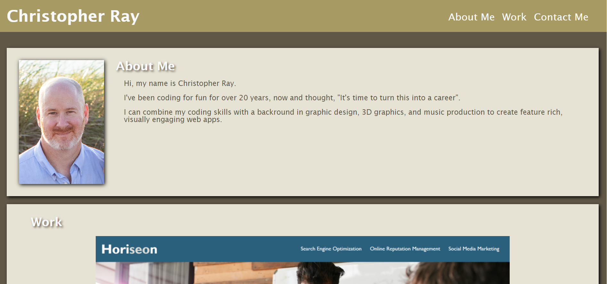

# Module 2 Challenge Portfolio

## Description

This is the Developer Portfolio web application. These files are for review for the Module 2 Portfolio Challenge.

## Installation

N/A

## Usage

This web app has been created from scratch and includes the following:

1. Developer photo and bio.

2. Samples of work with images and links.

3. Contact info including phone #, email address, and GitHub Repository link.

## Screenshot/Link

[Christopher Ray Portfolio](https://cray412.github.io/Module-2-Challenge-Portfolio/)

## Credits

N/A

## License

Please refer to the LICENSE in the repo.